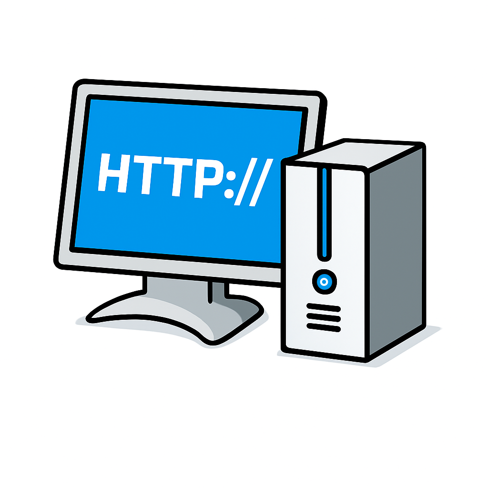

# Go WebDAV
  <br>

# About
Go WebDAV is a Network Attached Storage (NAS) server that is extremely minimal and lightweight to run. It is intended for one user; however, you are free to modify it if you would like to tailor it to a specific multi-user use case.

# How to Use
The following is a guide on how to get your own instance of Go WebDAV up and running. It is recommended to use the Docker method, but on a system with limited resources, the binary setup will likely work better.

## Docker (Recommended)
*NOTE: You will need to have Docker installed on your system before going through the following steps. Learn how to install it for your system: [https://docs.docker.com/engine/install/](https://docs.docker.com/engine/install/). For Windows and macOS, install Docker Desktop.*

- Start by cloning this repo to your system:  
  `git clone https://github.com/Tyguy047/Go-WebDAV.git`

- Edit the default username and password. To do this run `nano docker-compose.yml`, and change the `USERNAME` and `PASSWORD` variables. *This step is optional but recommended for security!*

- Once you have downloaded the repository, run the `docker-compose.yml` file by running:
  `docker compose up -d` or `make docker-up`
  *The `-d` flag runs the container detached.*

- That’s it! Now google a guide on how to connect to a NAS on Windows, macOS, or the file explorer of your choice on Linux. Once you find out how to connect, use this URL:  
  `http://<your-server's-ip>:8080`.

## Binary Install
*Ubuntu Server is recommended for running the binary since it comes with a lot of tools to get started quickly. I will not cover how to install those tools on other systems in this tutorial.*

- Download the binary from the [releases](https://github.com/Tyguy047/Go-WebDAV/releases/latest) page, unzip it, and transfer it to your server.  
  *To install directly to the server, use `wget <link_to_binary>` and unzip it on your server.*

- Create a new screen session with `screen`.

- You will also need to set a username and password by running:
```
export USERNAME=username
export PASSWORD=password
```
*USERNAME may default to the user you are going to run the binary as depending on your distro! It is important to pick a strong password if your NAS will be accessible over the internet!*

- Now to run the binary, use `./Go-WebDAV`.

- To exit screen, use `Ctrl+a` and then `Ctrl+d`.

That's all! Now google a guide on how to connect to a NAS on Windows, macOS, or the file explorer of your choice on Linux. Once you find out how to connect, use this URL:
`http://<your-server's-ip>:8080`.

## Building from Source
*If you want to build Go WebDAV yourself or contribute to development, you can use the included Makefile.*

**Prerequisites:**
- Go 1.25.5 or later installed
- Make utility (standard on macOS and Linux)

**Clone the repository:**
```bash
git clone https://github.com/Tyguy047/Go-WebDAV.git
cd Go-WebDAV
```

**Build commands:**
```bash
# Build for your local architecture
make local
# Output: bin/Local/Go-WebDAV

# Build for Linux AMD64 (most servers)
make linux-amd64
# Output: bin/Linux-AMD64/Go-WebDAV

# Build for Linux ARM64 (Raspberry Pi, ARM servers)
make linux-arm64
# Output: bin/Linux-ARM64/Go-WebDAV

# Build for all platforms at once
make all

# Clean build artifacts
make clean

# See all available commands
make help
```

**Running your local build:**
```bash
# Option 1: Build and run in one command
USERNAME=myuser PASSWORD=mypass make run

# Option 2: Build first, then run
make local
export USERNAME=myuser
export PASSWORD=mypass
./bin/Local/Go-WebDAV
```

**Docker build:**
```bash
# Build and start Docker container
make docker-up

# Stop Docker container
make docker-down

# Build Docker image only
make docker-build
```

## Implement Caddy (Optional)
Caddy is optional; however, it is recommended so that your files cannot be read by others who may be snooping on your network. Caddy is a reverse proxy that allows you to easily configure an HTTPS connection between you and your server rather than the default HTTP connection. Caddy will work best on a VPS rather than your home network.

*NOTE: To proceed with Caddy, you will **need to buy a domain** to access your NAS outside your home network. If your server is hosted at home, you will not likely need an HTTPS connection since your network is controlled by you. If you would like to access your NAS remotely for free, it is best to set up a WireGuard VPN, which can be quickly done via [PiVPN](https://www.pivpn.io) (you don’t need a Raspberry Pi to use PiVPN), but that will not be covered in this tutorial.*

- Visit Caddy’s website and follow the guide found there to install it for your server’s OS: https://caddyserver.com/docs/install.

- Once you install Caddy, we will edit the file to configure it to redirect traffic to Go WebDAV:

```
sudo rm -rf /etc/caddy/Caddyfile
sudo touch /etc/caddy/Caddyfile
```

- Now that we have a blank Caddyfile, we will configure Caddy to act as a reverse proxy. Run `sudo nano /etc/caddy/Caddyfile` and enter this configuration into it:

```
yourdomain.com {
        reverse_proxy localhost:8080
}
```

*Replace `yourdomain.com` with the domain you bought.*

- Save the configuration file by pressing `Ctrl+o`, then exit with `Ctrl+x` and `Enter`.

- Next, go to the website where you bought your domain and find your DNS records. Create a new A record and point it to your server’s IP address.

- Then run `sudo systemctl restart caddy`.

Congratulations — you now have an HTTPS-secured NAS! Now google a guide on how to connect to a NAS on Windows, macOS, or the file explorer of your choice on Linux. Once you find out how to connect, use this URL:  
`http://<your-server's-domain>`.

### Troubleshooting
- Make sure your Docker container or binary is running. For Docker, use `docker ps`. For the binary, use `screen -r`. Go WebDAV needs to be running in conjunction with Caddy.

- You may need to use `http://<your-server's-domain>:443` instead of just `http://<your-server's-domain>`.

# Development Info
- Coded in Go 1.25.5.
- Use the Makefile for building: `make help` shows all available build targets.
- Cross-compilation support for Linux AMD64 and ARM64 architectures.
- It is recommended to run in a Docker container so you can consistently set a username and password in the `docker-compose.yml` file.
- Developed on an M1 MacBook Air and cross-compiled for other architectures and platforms.
- By default, the Docker container runs Alpine Linux since it has an extremely small footprint and Go WebDAV is designed to be minimalistic.
- If you are hosting remotely, it is **HIGHLY RECOMMENDED** (but not required) to put it behind a reverse proxy like Caddy or NGINX so you can use HTTPS instead of the default HTTP.

# License
- Coded and developed by Tyler Caselli (Tyguy047). *Attribution and credit are required!*
- Licensed under the Mozilla Public License 2.0 (MPL-2.0). The full license can be read [here](https://github.com/Tyguy047/Go-WebDAV/blob/main/LICENSE).
- Please open an issue on GitHub to report a bug [here](https://github.com/Tyguy047/Go-WebDAV/issues).